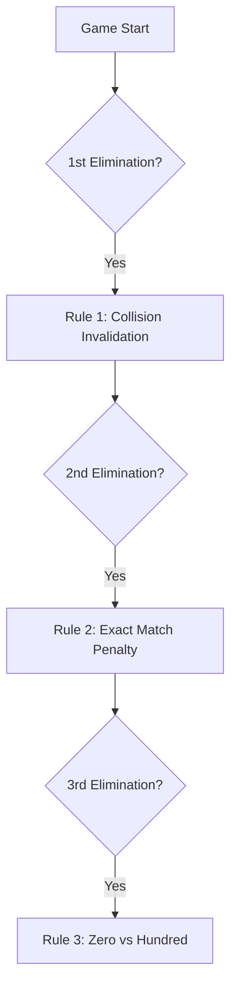
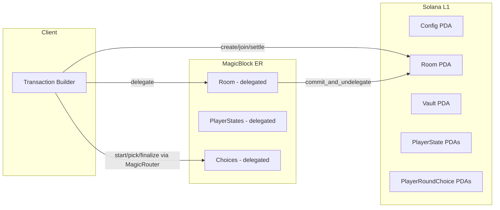
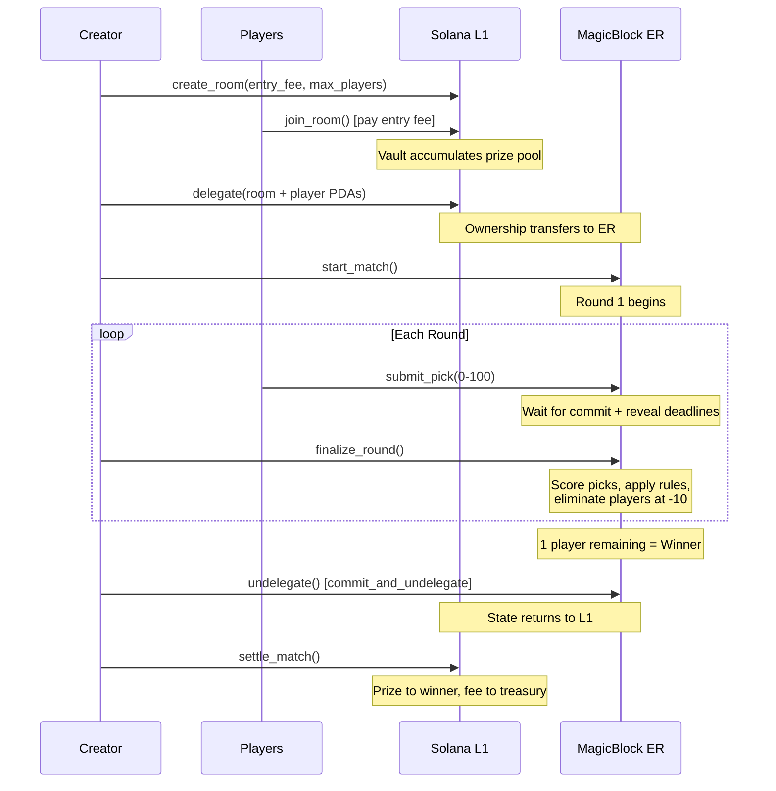
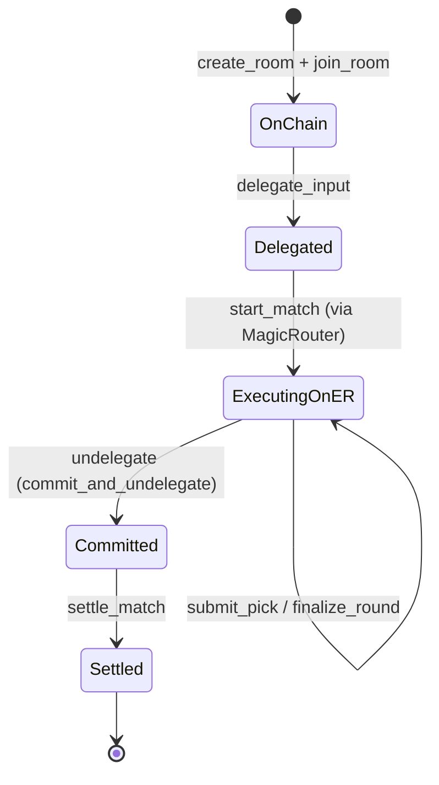
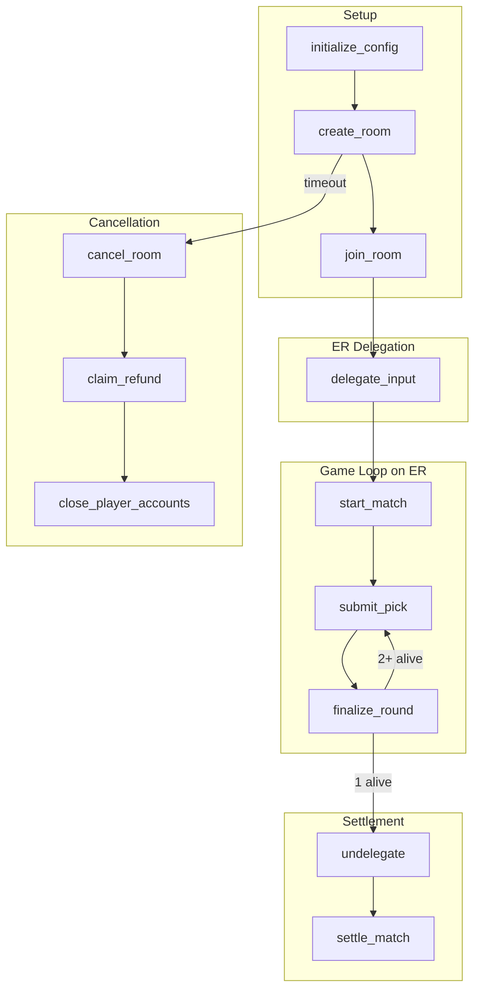
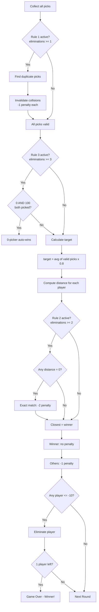

# Diamond Arena

A King of Diamonds (Alice in Borderland) game on Solana, built with **Anchor** and **MagicBlock Ephemeral Rollups**. Players enter rooms, pay entry fees, and compete in a battle-royale number-picking game with progressive rules. The last player standing wins the prize pool.

## Table of Contents

- [Overview](#overview)
- [Game Rules](#game-rules)
- [Progressive Rules](#progressive-rules)
- [Architecture](#architecture)
- [Game Flow](#game-flow)
- [Ephemeral Rollups Integration](#ephemeral-rollups-integration)
- [On-Chain Accounts](#on-chain-accounts)
- [Instructions](#instructions)
- [Scoring Algorithm](#scoring-algorithm)
- [Test Suite](#test-suite)
- [Setup and Running](#setup-and-running)

---

## Overview

Diamond Arena implements the King of Diamonds game from Alice in Borderland on Solana:

- A room creator sets an **entry fee** and **max players** (2–5)
- Players join by paying the entry fee into an on-chain vault
- Each round, players pick a number between **0 and 100**
- A **target** is computed as **80% of the average** of all valid picks
- The player closest to the target **wins** (no penalty)
- All others receive **minus points** (-1 per round lost)
- Players start at **0 minus points** and are eliminated at **-10**
- As players get eliminated, **progressive rules** activate making the game increasingly strategic
- Last player standing wins the entire prize pool (minus protocol fee)

Rounds execute on MagicBlock's Ephemeral Rollups for speed, and final state is committed back to Solana L1 for settlement.

---

## Game Rules

### Base Rules

| Mechanic | Value |
|----------|-------|
| Pick range | 0–100 |
| Target formula | 80% of average of valid picks |
| Round winner | Closest to target (tiebreak: earliest submission) |
| Loser penalty | -1 minus point |
| Elimination threshold | -10 minus points |
| Starting minus points | 0 |

### Timing (ER-tuned)

| Phase | Duration |
|-------|----------|
| Commit (submit picks) | 5 seconds |
| Commit (after new rule unlocks) | 8 seconds |
| Reveal buffer | 2 seconds |

---

## Progressive Rules

Rules unlock as players get eliminated, adding layers of strategy:



### Rule 1 — Collision Invalidation (after 1st elimination)

Duplicate picks are **invalidated**. Players who picked the same number:
- Are excluded from the target calculation
- Cannot win the round
- Receive -1 penalty

This punishes herding behavior and forces players to think independently.

### Rule 2 — Exact Match Penalty (after 2nd elimination)

If a player's pick lands **exactly** on the target value (distance = 0):
- Instead of winning, they receive **-2 penalty**
- The next closest player wins instead

This prevents players from gaming the system with perfect calculations.

### Rule 3 — Zero vs Hundred (after 3rd elimination)

If one player picks **0** and another picks **100**:
- The **0-picker automatically wins** the round regardless of target
- All others receive normal penalties

This creates a high-risk/high-reward gambit in late-game scenarios.

---

## Architecture



### Project Structure

```
diamond_arena/
├── programs/diamond_arena/src/
│   ├── lib.rs                     # Program entrypoint with #[ephemeral] macro
│   ├── constants.rs               # Seeds, timing, limits, thresholds
│   ├── error.rs                   # Custom error codes
│   ├── events.rs                  # Anchor events
│   ├── helper.rs                  # Core game logic (scoring, rules, elimination)
│   ├── state/
│   │   ├── config.rs              # Global config (admin, treasury, fee)
│   │   ├── room.rs                # Room state (status, rounds, prize pool)
│   │   ├── player_state.rs        # Per-player state (minus points, status)
│   │   └── player_round_choice.rs # Per-player round pick
│   └── instructions/
│       ├── initialize_config.rs   # Admin setup
│       ├── create_room.rs         # Create game room
│       ├── join_room.rs           # Join + pay entry fee
│       ├── start_match.rs         # Begin the match
│       ├── submit_pick.rs         # Submit pick for current round
│       ├── finalize_round.rs      # Calculate results, apply penalties
│       ├── settle_match.rs        # Distribute prize pool
│       ├── cancel_room.rs         # Cancel a waiting room
│       ├── close_accounts.rs      # Close player accounts (rent recovery)
│       ├── delegate_pda.rs        # Delegate PDAs to ER
│       └── undelegate.rs          # Commit and undelegate from ER
├── tests/
│   ├── diamond_arena.ts           # Full integration test (3 players, random picks)
│   ├── edge_cases.ts              # 21 edge case tests
│   ├── helper.ts                  # Test utilities
│   └── constants.ts               # Endpoints, seeds, keypaths
├── Anchor.toml
└── Cargo.toml
```

---

## Game Flow



---

## Ephemeral Rollups Integration

The game leverages [MagicBlock Ephemeral Rollups](https://magicblock.gg/) for fast round execution while maintaining Solana's security guarantees for settlement.



### Key Concepts

| Concept | Description |
|---------|-------------|
| **Delegation** | Transfers temporary PDA ownership to the ER validator |
| **MagicRouter** | Routes transactions to the ER endpoint transparently |
| **`#[ephemeral]`** | Anchor macro enabling automatic ER account serialization |
| **`#[commit]`** | Adds `magic_context` + `magic_program` accounts for commit operations |
| **`MagicIntentBundleBuilder`** | SDK builder for `commit_and_undelegate` operations |
| **`exit()`** | Persists account state changes within ER (for remaining_accounts) |

### ER Flow

1. **Delegate** — Room, PlayerState, and PlayerRoundChoice PDAs are delegated to ER
2. **Execute** — `start_match`, `submit_pick`, `finalize_round` execute on ER with low latency
3. **Commit & Undelegate** — Single `undelegate` instruction calls `commit_and_undelegate` via `MagicIntentBundleBuilder`, persisting final state back to L1
4. **Settle** — With state on L1, `settle_match` distributes the vault to the winner

### Dependencies

- `ephemeral-rollups-sdk = 0.8.8` (features: `anchor`, `access-control`)
- ER Devnet endpoint: `https://devnet-as.magicblock.app/`

---

## On-Chain Accounts

### Config

| Field | Type | Description |
|-------|------|-------------|
| `admin` | `Pubkey` | Program upgrade authority |
| `treasury` | `Pubkey` | Protocol fee recipient |
| `fee_bps` | `u8` | Fee in basis points (max 100 = 1%) |
| `bump` | `u8` | PDA bump |

**Seed:** `["config"]`

### Room

| Field | Type | Description |
|-------|------|-------------|
| `creator` | `Pubkey` | Room creator |
| `winner` | `Option<Pubkey>` | Winner (set when match finishes) |
| `room_id` | `u64` | Unique room identifier |
| `entry_fee` | `u64` | Entry cost in lamports |
| `created_at` | `i64` | Room creation timestamp |
| `commit_deadline` | `i64` | Deadline for pick submissions |
| `reveal_deadline` | `i64` | Deadline before finalization |
| `prize_pool` | `u64` | Total accumulated fees |
| `max_players` | `u8` | Max players (2–5) |
| `current_players` | `u8` | Players who joined |
| `active_players` | `u8` | Non-eliminated players |
| `current_round` | `u8` | Current round number |
| `eliminations` | `u8` | Total eliminations (drives rule activation) |
| `settled` | `bool` | Prize distributed flag |
| `status` | `RoomStatus` | `Waiting` / `Active` / `Finished` / `Cancelled` |
| `bump` | `u8` | PDA bump |
| `vault_bump` | `u8` | Vault PDA bump |

**Seed:** `["room", room_id.to_le_bytes()]`

### PlayerState

| Field | Type | Description |
|-------|------|-------------|
| `room_id` | `u64` | Room this player belongs to |
| `player` | `Pubkey` | Player wallet address |
| `minus_points` | `i8` | Starts at 0, eliminated at -10 |
| `status` | `PlayerStatus` | `Active` / `Eliminated` / `Winner` |
| `joined_at_round` | `u8` | Round when player joined |
| `bump` | `u8` | PDA bump |

**Seed:** `["player_state", room_id.to_le_bytes(), player.to_bytes()]`

### PlayerRoundChoice

| Field | Type | Description |
|-------|------|-------------|
| `room_id` | `u64` | Room ID |
| `round` | `u8` | Round number |
| `player` | `Pubkey` | Player wallet |
| `pick` | `Option<u8>` | Number choice (0–100) |
| `committed` | `bool` | Whether player submitted |
| `revealed` | `bool` | Reveal flag |
| `timestamp` | `i64` | Submission time (used for tiebreaks) |
| `bump` | `u8` | PDA bump |

**Seed:** `["player_round_choice", room_id.to_le_bytes(), player.to_bytes()]`

---

## Instructions



| # | Instruction | Description | Key Constraints |
|---|-------------|-------------|-----------------|
| 1 | `initialize_config` | Admin sets treasury + fee | Requires program upgrade authority |
| 2 | `create_room` | Create room with entry fee | Fee >= 0.01 SOL, max_players 2–5 |
| 3 | `join_room` | Join + pay entry fee | Room must be Waiting, not full |
| 4 | `start_match` | Begin the match | >= 2 players joined |
| 5 | `submit_pick` | Submit number 0–100 | Within commit deadline, once per round |
| 6 | `finalize_round` | Score and apply penalties | After reveal deadline |
| 7 | `settle_match` | Distribute prize pool | Match finished, on L1 |
| 8 | `cancel_room` | Cancel a waiting room | Creator or timeout (10 min) |
| 9 | `claim_refund` | Refund entry fee | Room must be cancelled |
| 10 | `close_player_accounts` | Reclaim rent | Room must be terminal |
| 11 | `delegate_input` | Delegate PDAs to ER | Room/PlayerState/PlayerChoice targets |
| 12 | `undelegate` | Commit and undelegate | Match must be finished |

---

## Scoring Algorithm



### Integer Math (no floating point)

The target is 80% of the average. To avoid decimals:

```
pick_scaled = pick * player_count * 5
target_scaled = sum_of_valid_picks * 4
distance = |pick_scaled - target_scaled|
```

Winner = smallest distance. Tiebreak = earliest `timestamp`.

---

## Test Suite

### Integration Tests (`diamond_arena.ts`)

Full 3-player game with random picks (0–100):

1. Initialize config (1% fee)
2. Create room (0.01 SOL entry, max 3 players)
3. All 3 players join
4. Delegate all PDAs to ER
5. Start match on ER
6. Run rounds until 1 player remains (random picks each round)
7. Undelegate (commit_and_undelegate back to L1)
8. Settle prize (winner gets pool minus 1% fee)

### Edge Case Tests (`edge_cases.ts`)

21 tests covering failure paths:

- Invalid max players / entry fee too low
- Room full / double join
- Not enough players to start
- Non-player starting match
- Invalid pick (>100) / wrong round
- Double commit in same round
- Finalize before reveal deadline
- Finalize after deadline (should succeed)
- Settle before match finished
- Cancel room (creator / timeout / non-creator blocked)
- Boundary picks (0 and 100 valid)

### Running Tests

```bash
# Full suite
anchor test

# Manual run
ANCHOR_WALLET=~/.config/solana/id.json yarn run ts-mocha -p ./tsconfig.json -t 1000000 "tests/**/*.ts"
```

---

## Setup and Running

### Prerequisites

- Rust (see `rust-toolchain.toml`)
- Solana CLI
- Anchor CLI 0.32.1
- Node.js + Yarn

### Build

```bash
anchor build
```

### Deploy

```bash
anchor deploy --provider.cluster devnet
```

### Program ID

```
CMZ49EUStUR9gj2PESATssmMu9hLPaUjhkgn8dmd85jY
```
