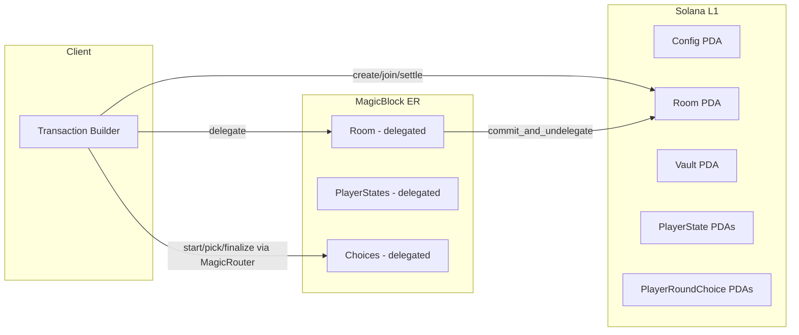

# Architecture

## High-Level Overview

## Account Model

### Config
Global singleton holding protocol settings.

| Field | Type | Description |
|-------|------|-------------|
| `admin` | `Pubkey` | Program upgrade authority |
| `treasury` | `Pubkey` | Protocol fee recipient |
| `fee_bps` | `u8` | Fee in basis points (max 100 = 1%) |
| `bump` | `u8` | PDA bump |

**Seed:** `["config"]`

### Room
Core game state for each match.

| Field | Type | Description |
|-------|------|-------------|
| `creator` | `Pubkey` | Room creator |
| `winner` | `Option<Pubkey>` | Set when match finishes |
| `room_id` | `u64` | Unique identifier |
| `entry_fee` | `u64` | Entry cost in lamports |
| `created_at` | `i64` | Creation timestamp |
| `commit_deadline` | `i64` | Pick submission deadline |
| `reveal_deadline` | `i64` | Finalization allowed after this |
| `prize_pool` | `u64` | Total accumulated fees |
| `max_players` | `u8` | Max players (2–5) |
| `current_players` | `u8` | Players who joined |
| `active_players` | `u8` | Non-eliminated players |
| `current_round` | `u8` | Current round number |
| `eliminations` | `u8` | Total eliminations (drives rule activation) |
| `settled` | `bool` | Prize distributed flag |
| `status` | `RoomStatus` | `Waiting` / `Active` / `Finished` / `Cancelled` |

**Seed:** `["room", room_id.to_le_bytes()]`

### PlayerState
Per-player state within a room.

| Field | Type | Description |
|-------|------|-------------|
| `room_id` | `u64` | Room this player belongs to |
| `player` | `Pubkey` | Player wallet address |
| `minus_points` | `i8` | Starts at 0, eliminated at -10 |
| `status` | `PlayerStatus` | `Active` / `Eliminated` / `Winner` |
| `joined_at_round` | `u8` | Round when player joined |

**Seed:** `["player_state", room_id.to_le_bytes(), player.to_bytes()]`

### PlayerRoundChoice
Per-player round pick (reused each round).

| Field | Type | Description |
|-------|------|-------------|
| `room_id` | `u64` | Room ID |
| `round` | `u8` | Round number |
| `player` | `Pubkey` | Player wallet |
| `pick` | `Option<u8>` | Number choice (0–100) |
| `committed` | `bool` | Whether player submitted |
| `timestamp` | `i64` | Submission time (used for tiebreaks) |

**Seed:** `["player_round_choice", room_id.to_le_bytes(), player.to_bytes()]`

## Constants

| Constant | Value | Description |
|----------|-------|-------------|
| `ELIMINATION_THRESHOLD` | -10 | Minus points to get eliminated |
| `MIN_PLAYERS` | 2 | Minimum to start a match |
| `MAX_PLAYERS` | 5 | Maximum per room |
| `MAX_NUMBER` | 100 | Maximum pick value |
| `COMMIT_DURATION` | 5s | Time to submit picks |
| `NEW_RULE_COMMIT_DURATION` | 8s | Extended time after new rule unlocks |
| `REVEAL_DURATION` | 2s | Buffer before finalization |
| `MIN_ENTRY_FEE` | 0.01 SOL | Minimum entry fee |
| `ROOM_WAIT_TIMEOUT` | 600s | Cancel timeout for waiting rooms |
