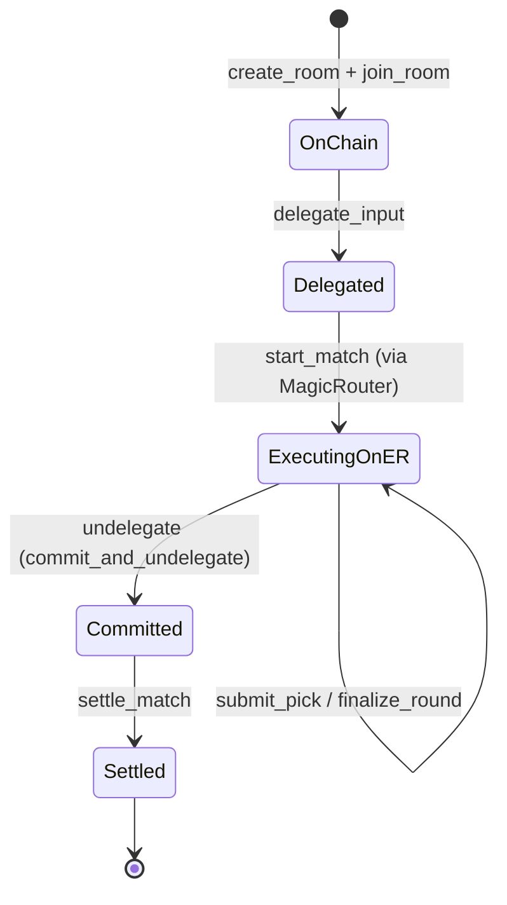

# Ephemeral Rollups Integration

The game uses [MagicBlock Ephemeral Rollups](https://magicblock.gg/) to run rounds off-chain with low latency while maintaining Solana's security guarantees for settlement.

## State Lifecycle



## Flow

1. **Delegate** — Room, PlayerState, and PlayerRoundChoice PDAs are delegated to the ER validator using `delegate_input`. This transfers temporary ownership to the ER cluster.

2. **Execute on ER** — `start_match`, `submit_pick`, and `finalize_round` are sent to the ER endpoint via the MagicRouter. Rounds execute with low latency off-chain.

3. **Commit & Undelegate** — A single `undelegate` instruction calls `commit_and_undelegate` via `MagicIntentBundleBuilder`, persisting final state back to L1 and releasing delegation in one step.

4. **Settle** — With state back on L1, `settle_match` distributes the vault to the winner.

## SDK Integration

### `#[ephemeral]` Macro

Applied to the program module. Enables automatic account serialization when executing on ER:

```rust
#[ephemeral]
#[program]
pub mod diamond_arena { ... }
```

### `#[commit]` Macro

Applied to instruction account structs that need commit/undelegate capabilities. Adds `magic_context` and `magic_program` accounts:

```rust
#[commit]
#[derive(Accounts)]
pub struct Undelegate<'info> { ... }
```

### `MagicIntentBundleBuilder`

Used to build commit_and_undelegate operations:

```rust
MagicIntentBundleBuilder::new(
    payer.to_account_info(),
    magic_context.to_account_info(),
    magic_program.to_account_info(),
)
.commit_and_undelegate(&accounts_to_undelegate)
.build_and_invoke()?;
```

### `exit()`

Called on accounts loaded via `remaining_accounts` (not in the Accounts struct) to persist their state changes within ER:

```rust
player_state.exit(&crate::ID)?;
room.exit(&crate::ID)?;
```

## Dependencies

- `ephemeral-rollups-sdk = 0.8.8` (features: `anchor`, `access-control`)
- ER Devnet endpoint: `https://devnet-as.magicblock.app/`
- MagicRouter: routes transactions transparently to the ER validator

## Delegation Targets

The `delegate_input` instruction accepts a `DelegateTarget` enum:

| Variant | Account Delegated |
|---------|-------------------|
| `Room` | Room PDA |
| `PlayerState` | PlayerState PDA for a specific player |
| `PlayerChoice` | PlayerRoundChoice PDA for a specific player |

All accounts involved in the game loop must be delegated before `start_match` is called on ER.
