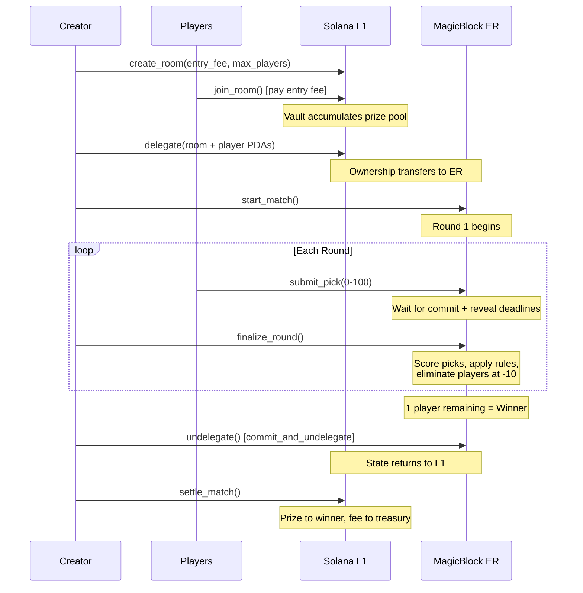
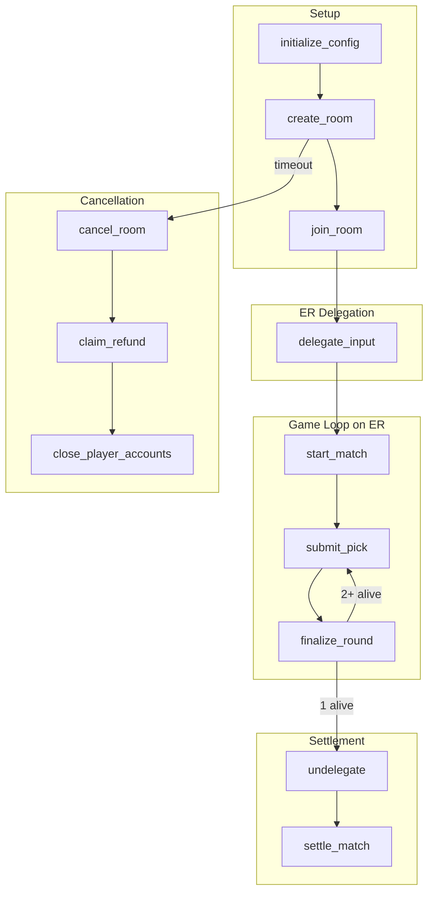

# Game Flow

## Full Lifecycle

## Instruction Flow

## Round Timing

Each round has two phases:

1. **Commit phase** — Players submit their picks (5 seconds, or 8 seconds if a new rule just unlocked)
2. **Reveal buffer** — Short wait before finalization is allowed (2 seconds)

After the reveal deadline passes, anyone can call `finalize_round` to resolve the round.

## Cancellation Flow

- Creator can cancel a room at any time while it's in `Waiting` status
- Any player can cancel after the room wait timeout (10 minutes)
- After cancellation, each player calls `claim_refund` to get their entry fee back
- `close_player_accounts` reclaims rent from PDAs once the room is in a terminal state
