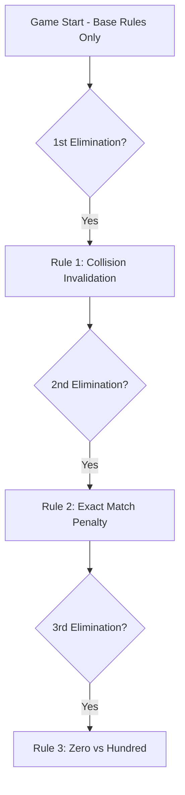

# Progressive Rules

Rules unlock as players get eliminated, adding layers of strategy to the game.

## Base Rules

- Pick a number between 0 and 100
- Target = 80% of the average of all valid picks
- Closest to target wins (no penalty)
- Everyone else: **-1 minus point**
- Eliminated at **-10 minus points**
- Tiebreak: earliest submission timestamp wins

## Rule 1 — Collision Invalidation

**Unlocks after:** 1st elimination

Duplicate picks are **invalidated**:
- Players who picked the same number as someone else are excluded from the target calculation
- They cannot win the round
- They receive -1 penalty

This punishes herding behavior and forces independent thinking.

## Rule 2 — Exact Match Penalty

**Unlocks after:** 2nd elimination

If a player's pick lands **exactly** on the target value (distance = 0):
- Instead of winning, they receive **-2 penalty**
- The next closest player wins instead

This prevents gaming the system with perfect calculations.

## Rule 3 — Zero vs Hundred

**Unlocks after:** 3rd elimination

If one player picks **0** and another picks **100**:
- The **0-picker automatically wins** the round regardless of target
- All others receive normal penalties

This creates a high-risk/high-reward gambit in late-game scenarios.

## Rule Activation Timing

When a new rule unlocks, the next round's commit phase is extended from 5 seconds to 8 seconds, giving players time to adjust their strategy.
