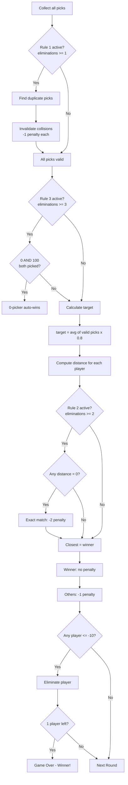

# Scoring Algorithm

## Overview



## Integer Math (No Floating Point)

The target is 80% of the average. To avoid floating-point arithmetic on-chain:

```
target = (sum_of_valid_picks / player_count) * 0.8
```

Rewritten as integer comparison:

```
pick_scaled   = pick * player_count * 5
target_scaled = sum_of_valid_picks * 4
distance      = |pick_scaled - target_scaled|
```

This is mathematically equivalent:
- `pick * count * 5` scales the pick
- `sum * 4` is the same as `(sum / count) * 0.8 * count * 5`
- Comparing scaled values avoids any division or decimals

## Winner Selection

1. Compute `distance` for each non-invalidated entry
2. Smallest distance = winner
3. Tiebreak: earliest `timestamp` (submission time)
4. If all picks are invalidated (everyone collided): no winner, everyone gets -1

## Penalty Application

| Condition | Penalty |
|-----------|---------|
| Round winner | 0 (no penalty) |
| Normal loser | -1 |
| Collision (Rule 1) | -1 (pick invalidated, cannot win) |
| Exact match on target (Rule 2) | -2 |
| Zero-vs-hundred loser (Rule 3) | -1 (normal) |

## Elimination Check

After penalties are applied, any player whose `minus_points <= -10` is marked `Eliminated`. The `room.eliminations` counter increments, potentially unlocking the next progressive rule.

## End Conditions

- **1 player remaining**: That player is the `Winner`, match status becomes `Finished`
- **0 players remaining**: Edge case where multiple players hit -10 simultaneously. Match ends with no winner (`winner = None`)
